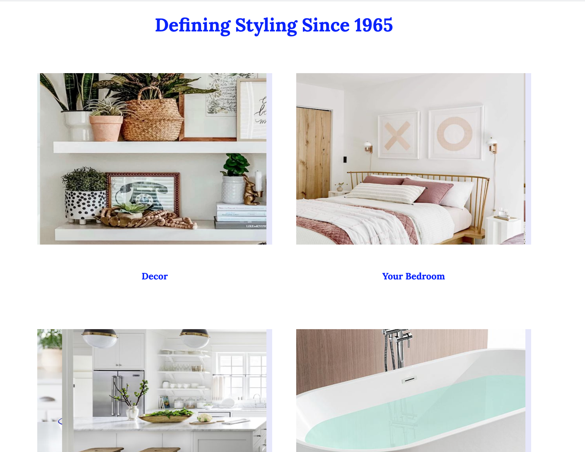

# A single page website
A single page website developed as part of CSCI 571 - Web Technologies @ USC

<h2>Project Goals</h2>
<ul>
  <li>Become familiar with basic HTML markup</li>
  <li>Adding CSS styles to a plain HTML document</li>
  <li>Replicate the actual website (given as an image) down to pixels, alignments, and font-styles</li>
</ul>

<h2>Screenshots of the developed website</h2>

Screenshot 1

Screenshot 2

